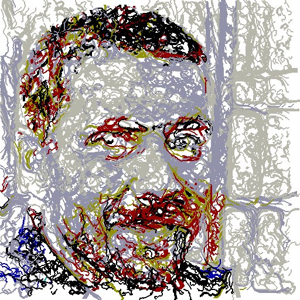
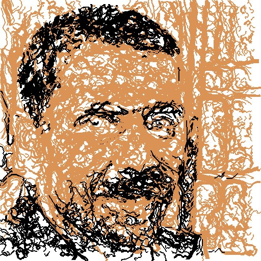

# image-to-paint

Generate a series of brushstrokes from an image. There are several parameters to vary the style and can also export GCODE for plotting.

This is a cleanup of an old school project from 2012. There are many code and methode improvments to be made.

Requires pygame and PIL

## Examples

```
 ./imageToPaint example/apple.jpg apple_out.jpg --brushes 2 4 
```


```
 ./imageToPaint example/humanoid.jpg humanoid_out.jpg --brushes 4 8

```


## Other options
./imageToPaint -h

```
usage: imageToPaint    [-h] [--brushes BRUSHES [BRUSHES ...]]
                       [--max_len MAX_LEN] [--min_len MIN_LEN]
                       [--f_grid F_GRID] [--colors COLORS [COLORS ...]]
                       [--lightdark LIGHTDARK] [--t T] [--f_l F_L] [--f_c F_C]
                       [--gcode] [--gc_feed GC_FEED] [--gc_tool GC_TOOL]
                       [--gc_width GC_WIDTH] [--gc_height GC_HEIGHT]
                       in out
	
positional arguments:
  in                    Path to input image.
  out                   Path to where to save output image.
	
optional arguments:
  -h, --help            show this help message and exit
  --brushes BRUSHES [BRUSHES ...]
                        Size of brushes strokes in pixels.
  --max_len MAX_LEN     Maximum stroke Length.
  --min_len MIN_LEN     Maximum stroke Length.
  --f_grid F_GRID       How spaced apart new strokes will be, 1 =
                        1*radius_stroke apart.
  --colors COLORS [COLORS ...]
                        Use a limited color palate.
  --lightdark LIGHTDARK
                        Paint brush strokes in increasing brightness.
  --t T                 Threshold to create a new stroke.
  --f_l F_L             Higher values will result in longer, less acurate
                        brushstrokes.
  --f_c F_C             Curvature modifier.
  --gcode
  --gc_feed GC_FEED     GCODE feedrate..
  --gc_tool GC_TOOL     GCODE tool.
  --gc_width GC_WIDTH   Width (in inches) for gcode.
  --gc_height GC_HEIGHT
                        Height (in inches) for gcode.
```

## Gcode Output:
Passing a set of different brush stroke sizes (radii) will result in writing a text file with the gcode for every brush of them.
These when plotted, appended, can construct the output image as a painting.
Each brush size has a number of strokes (stroke objects). These can be mapped to actions. So a stroke is an action on the canvas.
These actions are written as steps in the gcode output files.

For example, if the brush size array looks like this [2, 4, 8]. 4 text files will be written. One for each brush size.
The number of strokes increases as the brush radius decreases because smaller radii are used to represent/paint finer details within the painting.

## Colors:
Passing a set of colors to image-to-paint.py will result in matching every pixel color value to the closest one in this set. Thus the output image colors will only have the colors of the set.

Input image:
 

Example with 14 colors:
```
!python ./image-to-paint/imageToPaint rsz_image.png output.jpg --f_grid 6 --brushes 2 4 8 --colors 000000 FF0000 00FF00 0000FF FFFF00 FF00FF 00FFFF C0C0C0 808080 800000 808000 008000 008080 000080
```
 
 
 Example with 2 colors:
 ```
!python ./image-to-paint/imageToPaint rsz_image.png output.jpg --f_grid 6 --brushes 2 4 8 --gcode --colors 000000 d8965a
```
 

## Strokes to Gcode:

Each stroke object has:
 * move_list: represents a set of points as an array of tuples. Each tuple represents one point. These points are connected with lines that form the outer shape of the stroke.
 * color: a tuple of RGB values. i.e (255,255,255).
 * color_number: the position of the color number in the color palette.
 * radius: the brush size of the stroke.
 * brush_number: the position of the brush amongst the used brushes.
 
 move_list represent the start & end points used for linear interpolation while plotting. So working with bezier curves will demand performing interpolation using the start, end & control points to construct data points ON the curve. Thus these can be used as an input to the Stroke constructor. So we'll have to translate each bezier curve to a Stroke object.


